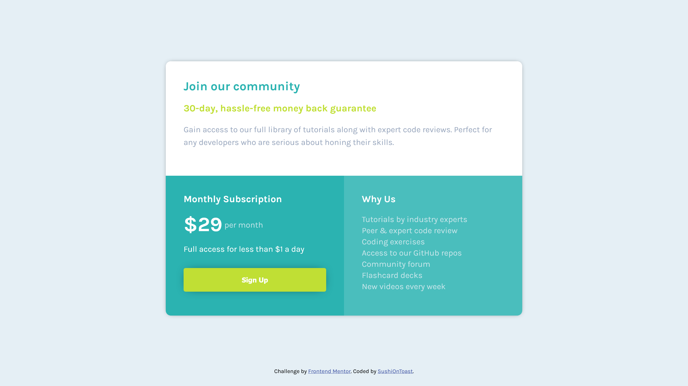
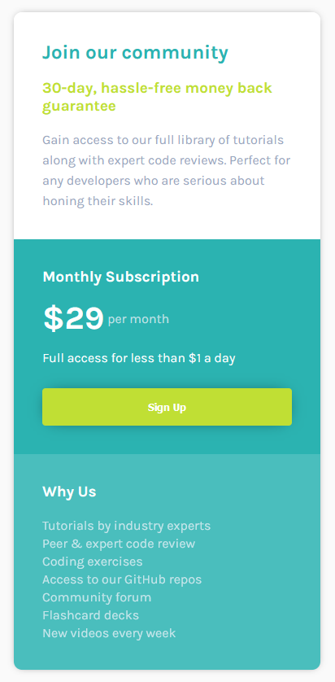

# Frontend Mentor - Single price grid component solution

This is a solution to the [Single price grid component challenge on Frontend Mentor](https://www.frontendmentor.io/challenges/single-price-grid-component-5ce41129d0ff452fec5abbbc). Frontend Mentor challenges help you improve your coding skills by building realistic projects. 

## Table of contents

- [Overview](#overview)
  - [The challenge](#the-challenge)
  - [Screenshot](#screenshot)
  - [Links](#links)
- [My process](#my-process)
  - [Built with](#built-with)
  - [What I learned](#what-i-learned)
  - [Continued development](#continued-development)
  - [Useful resources](#useful-resources)
- [Author](#author)
- [Acknowledgments](#acknowledgments)

## Overview

### The challenge

Users should be able to:

- View the optimal layout for the component depending on their device's screen size
- See a hover state on desktop for the Sign Up call-to-action

### Screenshot




### Links

- [Solution URL (hosted on github pages)](https://sushiontoast.github.io/frontend-mentor-single-grid-pricing-component-challenge/)

## My process

### Built with

- Semantic HTML5 markup
- CSS
- JavaScript

**Note: I am still very much a beginner so my knowledge is quite limited**

### What I learned

It was quite difficult trying to adapt the page to responsive design.

Here's a small snippet of my CSS to demonstrate how I achieved this:
```css
/* Initially setting it to inline block so both components sit next to each other */
.subscription,
.why-us {
  width: 50%;
  height: 100%;
  display: inline-block;
  vertical-align: top;
}
```
```css
/* Changing the layout when the screen reaches the max-width specified (acommodating to different screens) */
@media screen and (max-width: 757px) {
  .main-container {
    width: 100%; /* the screen was small but not small enough to switch to the mobile version */
  }
}

@media screen and (max-width: 590px) {
  .intro,
  .subscription,
  .why-us {
    display: block; /* making sure they stack */
    width: 100%;
    height: auto;
  }

  .main-container {
    height: auto;
    transform: translatey(0%);
  }
}
```

### Continued development

I definitely want to focus on responsive design as that proved to be quite difficult for me, along with organising my code better.

### Useful resources

- [W3schools](https://www.w3schools.com/css/) - Helped me with styling certain elements
- [MDN web docs](https://developer.mozilla.org/en-US/) - Perfect for reference and looking at CSS attributes in detail

## Author

- Frontend Mentor - [@SushiOnToast](https://www.frontendmentor.io/profile/SushiOnToast)
- CodePen - [@SushiOnToast](https://codepen.io/SushiOnToast)
- CodeWars - [@SushiOnToast](https://www.codewars.com/users/SushiOnToast)

## Acknowledgments

I stumbled upon this challenge while following a tutorial by Zach Gollwitzer on YouTube - so big thanks to him for teaching me so much!

